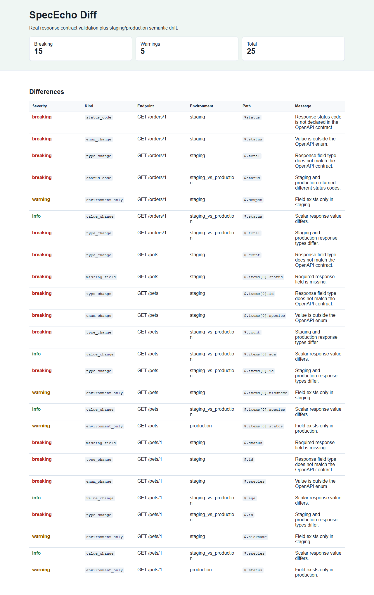

# SpecEcho Diff

[](https://github.com/KanadeK/spececho-diff/actions/workflows/ci.yml)
[](LICENSE)
[](https://github.com/KanadeK/spececho-diff/releases)

SpecEcho Diff checks real API responses against an OpenAPI 3.x contract, then compares staging and production responses for semantic drift.



- Finds missing fields, type changes, enum changes, status-code drift, environment-only fields, and value drift.
- Runs safely against localhost by default, with explicit host allowlisting for other targets.
- Emits Markdown, JSON, and HTML reports from the same tested domain core.

Status: `v0.1.0`

## Quick Start

```bash
python -m pip install -e '.[dev]'
python scripts/demo.py
python -m spececho_diff.cli compare --spec examples/petstore/openapi.yaml --staging http://localhost:8011 --production http://localhost:8012 --output report.html --format html
```

The demo command runs deterministic fixture apps in process and writes:

- `site/index.html`
- `site/spececho-report.md`
- `site/spececho-report.json`

## Real Input To Output

Input: `examples/petstore/openapi.yaml` plus the staging and production fixture apps in `examples/petstore/`.

Output excerpt:

```text
missing_field  GET /pets/1  staging  $.status
type_change    GET /pets/1  staging  $.id
enum_change    GET /orders/1 staging  $.status
status_code    GET /orders/1 staging  $status
```

The process exits with code `0` when there are no breaking changes, `2` when breaking changes are found, and `3` for configuration errors.

## Features

- OpenAPI 3.x YAML/JSON import with local `$ref` resolution.
- HTTP probing through `httpx` with a safety whitelist.
- Contract checks for status codes, required fields, primitive types, arrays, objects, and enums.
- Staging vs production semantic diff.
- CLI and local FastAPI report UI.
- Markdown, JSON, and standalone HTML report outputs.
- Sensitive headers are read only from environment variables and are redacted before display.

## Non-Goals

- SpecEcho Diff is not a full OpenAPI linting suite.
- It does not mutate APIs or write test data to target systems.
- It does not promise uniqueness; public GitHub sampling did not find an active same-name, highly isomorphic project.

## Architecture

The package separates pure domain logic from adapters:

- `spececho_diff.domain`: OpenAPI parsing, schema checks, and semantic diff.
- `spececho_diff.adapters`: file and HTTP boundaries.
- `spececho_diff.services`: use-case orchestration.
- `spececho_diff.cli` and `spececho_diff.app`: user entry points.

See `docs/ARCHITECTURE.md` for details.

## Commands

```bash
make verify
make demo
make package
make release-check
```

On Windows without `make`, use the matching scripts in `scripts/*.ps1` or `python scripts/verify.py`.

## Privacy And Security

Targets are limited to localhost by default. Add `--allow-host api.example.com` only for systems you own or have permission to test. Headers are loaded from named environment variables such as `SPECECHO_HEADER_AUTHORIZATION`; they are not written to reports.

## Roadmap

- Request body generation from OpenAPI examples.
- Authentication profiles with encrypted local storage.
- SARIF export for CI annotations.

## Contributing

Please read `CONTRIBUTING.md`, `SECURITY.md`, and `CODE_OF_CONDUCT.md`.

## Similar Projects

The competitor scan in `docs/COMPETITOR_SCAN.md` found strong OpenAPI spec-diff and validator projects. SpecEcho Diff focuses on runtime response evidence plus staging/production semantic drift in one reproducible workflow.

## FAQ

**Can I point it at production?** Yes, only when you explicitly allow the host and have permission.

**Does it store tokens?** No. Sensitive headers come from environment variables and are redacted.

